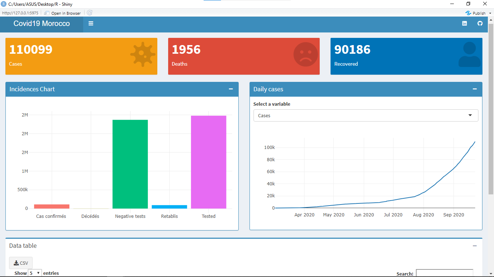
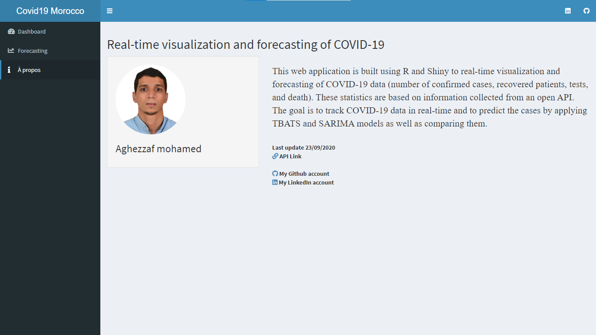

# Real-time-visualization-and-forecasting-of-COVID-19

<a href="https://covid-19morocco.herokuapp.com"><h2>Live demo</h2><a/>  

Application for real-time visualization and forecasting of COVID-19, data on the number of patients diagnosed, the number of patients who died and the number of patients cured. These figures are based on information from the Geomatic API, Morocco.

## Dashboard

Visualization of covide-19

###	Authentification

Forecasting of covide-19 with  TBASTS and SARIMA

### About

This window show information about application

### Contact
Linkedin: <a href="https://www.linkedin.com/in/mohamed-aghezzaf/">aghezzafmohamed<a/>  
Gmail: aghe.mohamed@gmail.com
